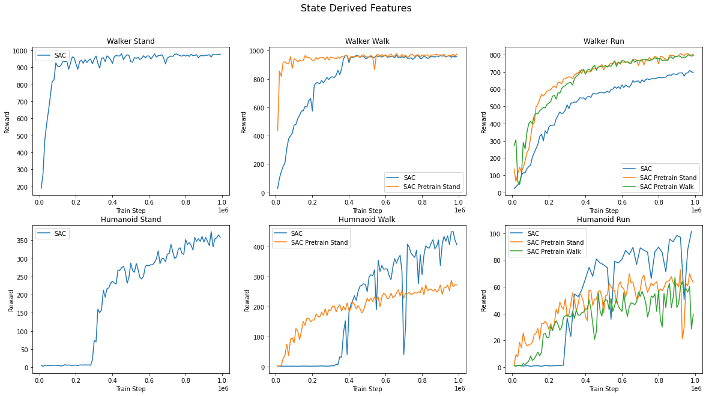
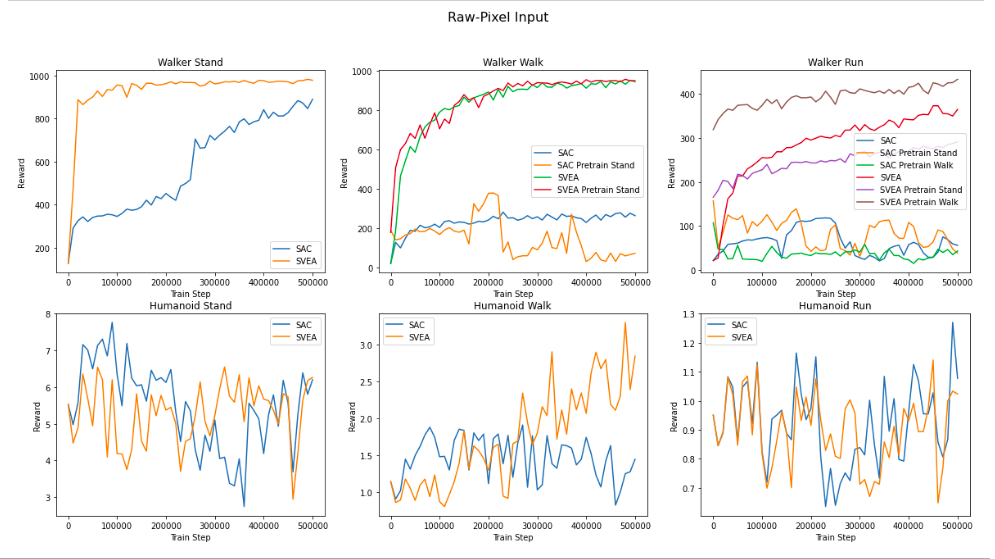

# 02456 Deep Learning Course Project: Task Adaptation for Continuous Control using Deep Reinforcement Learning

[[Poster]](results/final_poster.pdf) [[Report]](results/final_report.pdf)

## Algorithms

This repository contains implementations of the following algorithms in a unified framework:

- [SVEA (Hansen et al., 2021)](https://arxiv.org/abs/2107.00644) on raw-pixels
- [SAC + AE (Denis et al., 2020)](https://arxiv.org/abs/1910.01741) on raw-pixels
- [SAC (Haarnoja et al., 2018)](https://arxiv.org/abs/1812.05905) on state-derived-features

using standardized architectures and hyper-parameters, wherever applicable. If you want to add an algorithm, feel free to send a pull request.

## Setup
We assume that you have access to a GPU with CUDA >=9.2 support. All dependencies for pixel related experiments can then be installed with the following commands:

```
conda env create -f raw-pixel-input/setup/conda.yml
conda activate dmcgb
sh raw-pixel-input/setup/install_envs.sh
```

## Training & Evaluation

The `state-derived-features` and `raw-pixel-input` directories contain training and evaluation bash scripts for all the included algorithms. Alternatively, you can call the python scripts directly, e.g. for training call

```
xvfb-run -a python3 src/train.py --seed 0 \
 --domain_name walker --task_name run --algorithm svea \
 --pretrain True --pretrain_dir logs/walker_walk/svea/0/model \
 --pretrain_steps 500000 --pretrain_task_name walk
 
 ```

```
xvfb-run -a python state-derived-features/train.py env=walker_run
```


The outputs at every step have `ER` and `ERTEST` corresponds to the average return in the training and test environments, respectively. 


## Results
### State Derived Features:


### Raw Pixel Input:


## References

 - [DMControl Generalization Benchmark](https://github.com/nicklashansen/dmcontrol-generalization-benchmark)
 - [Soft Actor-Critic (SAC) implementation in PyTorch](https://github.com/denisyarats/pytorch_sac)